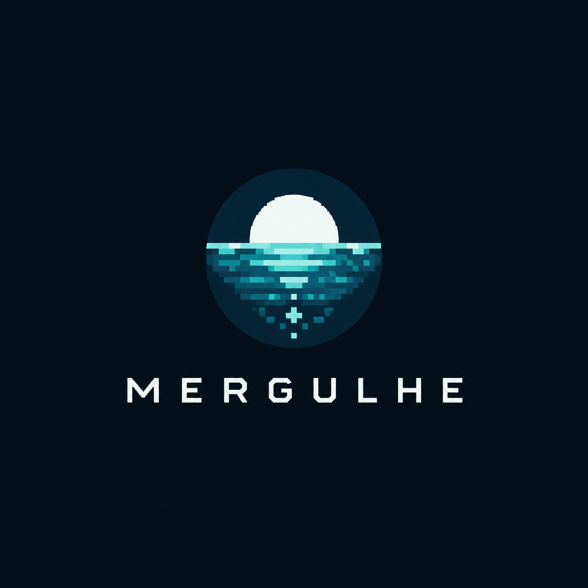

# Mergulhe — proposta de marca

Status: proposta para discussão, em 29/09/2026. A logo encontrada no projeto é a referência provisória; sua escolha e a direção de personalidade ainda precisam ser confirmadas pelo usuário. Este documento define uma direção, sem aplicar o redesign ao produto.

## Ideia central

**Mergulhe é um oceano que cresce com o seu foco.**
**Assinatura: Seu foco dá vida ao seu oceano.**
**Personalidade: calma, imersiva e curiosa.**

O produto transforma sessões de concentração em vida e descobertas em um oceano virtual. A marca aproxima dois momentos: o silêncio de estudar ou trabalhar e a satisfação de ver um pequeno mundo ganhar vida. A recompensa visual dá sentido à constância, sem exigir uma personalidade competitiva.

Público inicial: pessoas que estudam, trabalham ou criam e querem reservar tempo para uma tarefa. O diferencial a demonstrar é o ciclo real de foco, progresso marinho e descoberta. A comunicação descreve esse mundo virtual, sem prometer ganho de produtividade medido, efeito terapêutico ou restauração ambiental real.

## Diagnóstico do projeto

- A logo de referência usa lua, horizonte e reflexo em pixels; Home e Onboarding ainda exibem uma pequena onda de `WaveMark`, e o favicon usa outra composição de ondas.
- Outfit, Cormorant Garamond e Pixelify Sans já estão disponíveis, mas títulos, etiquetas e ações precisam de papéis visuais mais definidos para acompanhar a logo.
- Botões retangulares, cartões com diferentes raios e navegação arredondada convivem sem um padrão explícito. Muitos rótulos usam texto pequeno, baixa opacidade e espaçamento amplo entre letras.
- A narrativa já existe no produto e em `docs/launch-mergulhe.md`. Neste checkout, a landing tem um plano escrito; não foi encontrada uma implementação dedicada.

## Direção visual: oceano noturno vivo

O fundo escuro cria profundidade. O turquesa guia a ação e sugere vida. A lua e o reflexo estabelecem a assinatura visual. A interface organiza a experiência com formas simples e legíveis; o mundo marinho conserva sua arte em pixels.

Paleta proposta, inspirada na logo e no produto; os valores abaixo são escolhas de design, não uma extração exata da imagem.

| Cor | Valor | Papel |
| --- | --- | --- |
| Oceano noturno | `#061018` | Fundo principal, já usado pelo app |
| Água profunda | `#0B2433` | Superfícies de cartões e painéis |
| Turquesa vivo | `#53D6D2` | Ação principal, seleção e progresso |
| Espuma | `#E7F2F2` | Texto principal, já usado pelo app |
| Névoa | `#A8BEC8` | Texto secundário legível |
| Areia | `#C4A574` | Destaques pontuais de descoberta, já usado pelo app |

As cores dos seis biomas continuam pertencendo aos cenários. Botões e navegação conservam a identidade turquesa entre as regiões. Estados de erro e aviso recebem cores próprias e texto explicativo. Cada combinação de texto e superfície deverá ter contraste verificado na implementação.

## Logo e tipografia

Preservar o símbolo e o lettering da logo fornecida. O nome da marca não deve ser recomposto com Pixelify Sans como se fosse a mesma assinatura. Preparar versões com símbolo isolado, assinatura horizontal, versão monocromática e fundo transparente a partir da arte confirmada; definir área de respiro e tamanho mínimo após testar a leitura em ícone, cabeçalho e loja.

**Outfit** organiza títulos, explicações, controles e números do timer. Pesos regulares e médios mantêm leitura confortável. **Pixelify Sans** aparece pontualmente em etiquetas de descoberta; não assume textos longos nem controles essenciais. **Cormorant Garamond**, hoje frequente nos títulos, deixa de ser a voz principal nessa proposta; a atmosfera vem do oceano, da luz e do espaço. A escolha mantém as fontes já disponíveis no projeto.

## Linguagem e componentes

- Voz acolhedora, direta e com poesia breve. Explicar primeiro o que fazer; reservar metáforas para ambientação e celebração.
- Convite: “Reserve um tempo para o que importa.” Explicação: “Escolha a duração e comece sua sessão de foco.” Celebração: “Sessão concluída. Seu oceano ganhou mais vida.”
- Vocabulário: “Mergulhar” abre a preparação; “Iniciar foco” começa o timer; “Pausar”, “Retomar” e “Encerrar sessão” descrevem ações com clareza. “Ver o oceano” encerra o resumo.
- Botão principal com fundo turquesa e texto azul profundo. Secundário com borda discreta. Uma ação principal por etapa; estados de foco, seleção, carregamento e indisponibilidade reconhecíveis.
- Padrão inicial: controles e cartões com raio de 12 px, espaçamento em múltiplos de 8 px e alvos de toque de pelo menos 44 px. Navegação usa a mesma família de ícones de traço, com rótulos legíveis.
- Movimento lento no ambiente e transições curtas nos controles, respeitando redução de movimento. A confirmação de progresso deve ser tranquila; a linguagem de retorno não culpa quem interrompe ou fica dias sem usar.

## Aplicação no app

| Momento | Papel da marca | Hierarquia proposta |
| --- | --- | --- |
| Primeiro acesso | Apresentar a relação entre foco e vida marinha | Logo → promessa → explicação curta → continuar |
| Oceano inicial | Tornar o mundo pessoal e convidar ao foco | Bioma e cenário → progresso local → Mergulhar → resumo do dia |
| Preparação | Tornar a escolha de duração simples | Duração → seleção → Iniciar foco |
| Foco | Dar espaço à tarefa fora da tela | Tempo legível → cenário discreto → pausa e encerramento |
| Conclusão | Tornar o resultado visível | Sessão concluída → tempo e vida ganhos → descoberta quando houver → Ver o oceano |
| Exploração e descobertas | Recompensar a curiosidade | Arte do bioma ou espécie → nome → informação → ação |
| Perfil | Facilitar leitura e controle | Histórico → conta e preferências → dados → prévia Plus |

## Aplicação na landing

**Hero proposto**

> Seu foco dá vida ao seu oceano.
>
> Transforme sessões de estudo e trabalho em vida e descobertas num oceano virtual.

Usar logo, mesma paleta e Outfit. Mostrar uma captura ou gravação real do app como elemento principal. A sequência seguinte demonstra “escolha um tempo → concentre-se → veja seu oceano ganhar vida”, apresenta biomas e descobertas, explica as plataformas e responde às dúvidas antes do rodapé.

O CTA depende da disponibilidade real: instalação somente com listagem publicada e link verificado; acesso ao app somente quando houver uma versão web pública. Enquanto isso, uma ação interna “Veja como funciona” pode conduzir à demonstração, com plataformas futuras identificadas como “em breve”.

As imagens de estudo e trabalho já existentes em `mergulhe-grid` ajudam a apresentar momentos de uso e atmosfera. São referências de comunicação, não capturas da interface nem depoimentos de usuários. A landing deve distinguir essas cenas das demonstrações reais do produto.

Foco, biomas e descobertas continuam gratuitos conforme `docs/plus-offer.md`. Plus permanece apresentado de acordo com a disponibilidade efetiva, sem preço ou benefício pago inventado. Informações sobre conta, progresso e sincronização devem ser verificadas no produto atual antes de publicar a página.

## Sequência de alinhamento

1. Confirmar a arte da logo e a personalidade desejada; revisar esta proposta com essas escolhas.
2. Preparar as variações técnicas da marca e uma amostra visual da tela inicial, do foco e do hero da landing para avaliar a direção aplicada.
3. Consolidar cores, tipografia e componentes e alinhar as telas do app, incluindo modais e extensão.
4. Implementar a landing com demonstrações reais e destinos disponíveis; alinhar ícones e imagens das lojas.
5. Validar leitura, contraste, toque, estados e movimento em celular e desktop antes de concluir o redesign.
